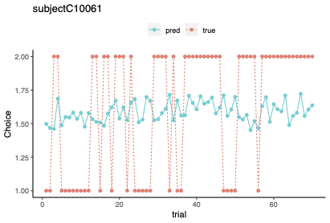
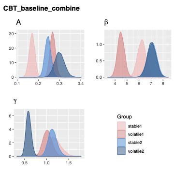
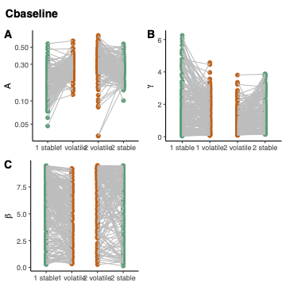
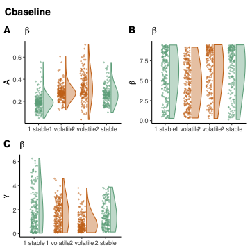
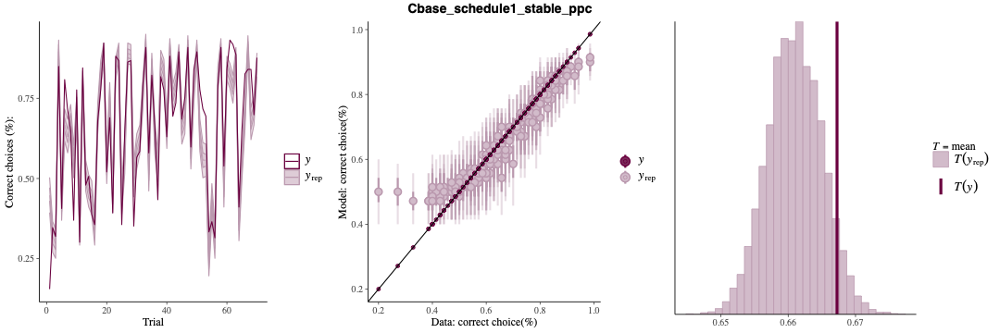

# Computational Modelling Analysis of Decision-making Behaviour of Clinical Population 
## Table of Contents
1. Preprocess raw behavioural data, handling missing data and formatting and sorting out datasets.
2. Combine behavioural data and clinical data.
3. Hierarchical Bayesian Analysis to estimate cognitive parameters
4. Extract estimated parameters and Leave-One-Out Information Criteria for model comparison
5. Visualization of estimated parameters
## Description
Bayesian workflow of doing computational modelling analysis of human decision-making behaviour on an [Aversive Learning Task](https://dcu-ra-task.herokuapp.com/rat/testStudy/testParticipant), 
which can be used to measure how people adapt their learning rates when the environment changes from stable to volatile or the other way around.

## Key Features
- Cognitive models are constructed in [Stan](https://mc-stan.org/)
- Posterior distributions of the cognitive parameters are estimated
- Posterior predictive checks are conducted to validate the predictive performance of the models

## Key parameters of the cognitive models
- Learning rate parameter 
- Risk preference parameter
- Inverse temperature parameter

## Example plots
### Behavioural data of one subject
 
### Group-level Posterior distributions of CBT baseline group
 
### Individual-level parameter change in stable and volatile environments
 
### Posterior predictive check

